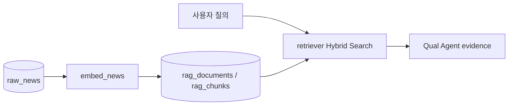

# `src/stock_agent/rag/` - PostgreSQL/pgvector 검색

> 뉴스·공시 텍스트를 임베딩하고 키워드·벡터 검색을 결합해 Qual Agent 근거를 제공합니다.

## 폴더 소개

- **What:** 임베딩 적재, pgvector 유사도 조회, Hybrid Search를 제공합니다.
- **Why:** Qual Agent가 모델 기억이 아니라 저장된 근거를 인용하게 합니다.
- `embed_news.py`가 원천 뉴스 텍스트를 임베딩 적재 형태로 변환합니다.
- `pgvector_store.py`가 일반 유사도 검색 helper를 제공합니다.
- `retriever.py`가 키워드와 벡터 후보를 합치고 점수를 정규화합니다.

## 기술 스택

| 기술 | 역할 |
|------|------|
| sentence-transformers | 한국어 포함 텍스트 임베딩 |
| PostgreSQL GIN | 키워드 후보 검색 |
| pgvector | cosine distance 벡터 검색 |
| psycopg | DB 조회와 vector 등록 |

## 동작 원리



## 파일

| 파일 | 역할 |
|------|------|
| `embed_news.py` | 뉴스 텍스트 선택·임베딩 적재 |
| `pgvector_store.py` | 유사 청크 조회 |
| `retriever.py` | 뉴스·공시 Hybrid Search |

## 주요 결과와 검증

2026-06-12 평가의 RAGAS faithfulness는 **0.4096**으로 목표 0.80 미달입니다. 근거 미검색 시 warning을 유지하며 품질을 과장하지 않습니다.

```bash
python -m pytest tests/rag -v
python eval/run_benchmark.py --limit 2
```

로컬 Anaconda의 패키지 메타데이터가 손상된 경우 `sentence_transformers` import에서 수집 오류가 날 수 있습니다.
